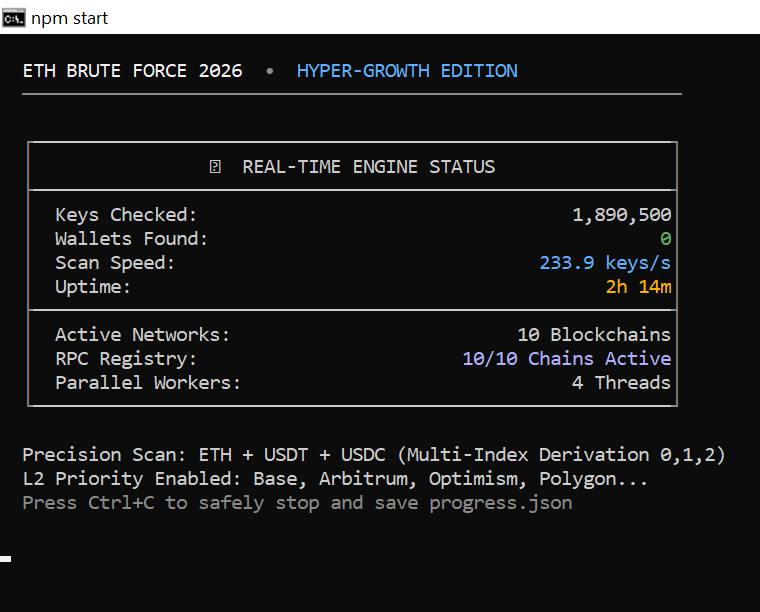

# SeedphraseScout — Professional Blockchain Research Console (2026 Edition) 🔐

> **SeedphraseScout** is an educational blockchain security research engine that demonstrates why brute-forcing seed phrases is computationally infeasible.

[](./package.json)
[](https://nodejs.org/)
[](./LICENSE)
[](#)

**#SeedphraseScout #BlockchainSecurity #Web3Research #2026Ready**

---

## 📸 Dashboard Preview



Run `npm start` to launch the live terminal dashboard.

---

## ✨ Why this project stands out

- **Research-first architecture** focused on educational blockchain analysis.
- **High-throughput worker model** using Node.js `worker_threads`.
- **Multi-chain wallet derivation and checks** across major EVM networks.
- **RPC resilience layer** with rotation/fallback behavior.
- **Clear separation of concerns** (`core`, `rpc`, `ui`, `utils`) for maintainability.

---

## 🚀 Quick Start

```bash
git clone https://github.com/your-username/seedphrase-scout.git
cd seedphrase-scout
npm install
npm start
```

### Optional environment setup

```bash
cp .env.example .env
```

---

## 🧭 Command Reference

| Command | Purpose |
|---|---|
| `npm start` | Start the engine and live dashboard |
| `npm test` | Run diagnostics mode |
| `npm run lint` | Run ESLint checks |

---

## 🏗️ Architecture at a glance

```text
src/
├── core/   -> engine, checker, workers
├── rpc/    -> endpoint management + health/recovery
├── ui/     -> terminal dashboard
└── utils/  -> constants and shared config
```

---

## 🔐 Educational & Ethical Notice

This repository exists for **security education and engineering research**.

- Seed phrase search space is astronomically large (`2^128` scale).
- Practical brute-force recovery of random wallets is not feasible.
- Do **not** use this software for unlawful or malicious activity.

---

## 🗺️ 2026 Professionalization Focus

- Stronger repository metadata and discoverability
- Better onboarding and contributor UX
- Cleaner public documentation and positioning
- Consistent branding for open-source presentation

---

## 🤝 Contributing

Please read [CONTRIBUTING.md](./CONTRIBUTING.md) before opening a PR.

## 📄 License

Licensed under the [MIT License](./LICENSE).

---

Built for modern blockchain education in **2026**.
